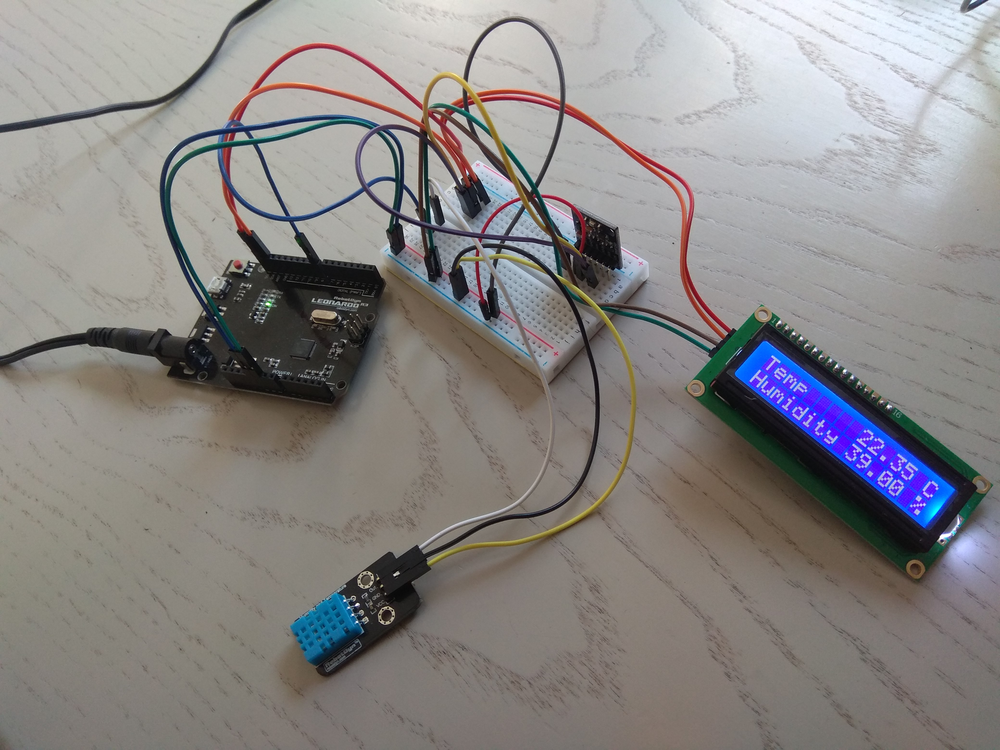

This is a small Arduino project that a features a thermometer that also shows Humidity, Preasure and Altitude.

The screen 1602 I2C screen and the BMP sensor are talking through the I2C protocol through different addresses.DHT11
thermometer is inputing on pin 8

TO use just flush it in your arduino and connect to the right pins

